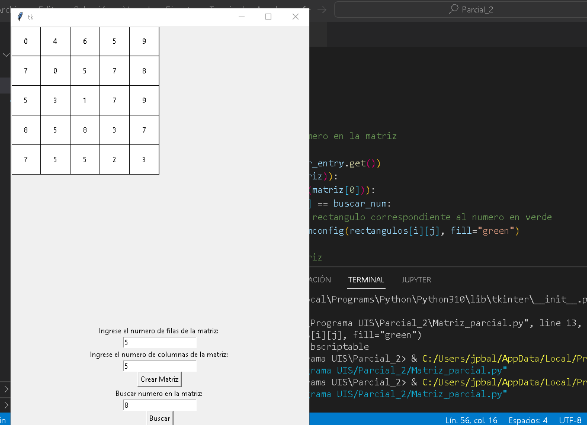

# Parcial_2

La app debe tener una interfaz grafica donde el usuario ingrese el tamaño de una matriz, donde los numeros sean aleatorios y que cuando el usuario quiera buscar un numero el programa
detecte si esta el numero en la matriz, sino, se dice que no se encuentra el numero.

